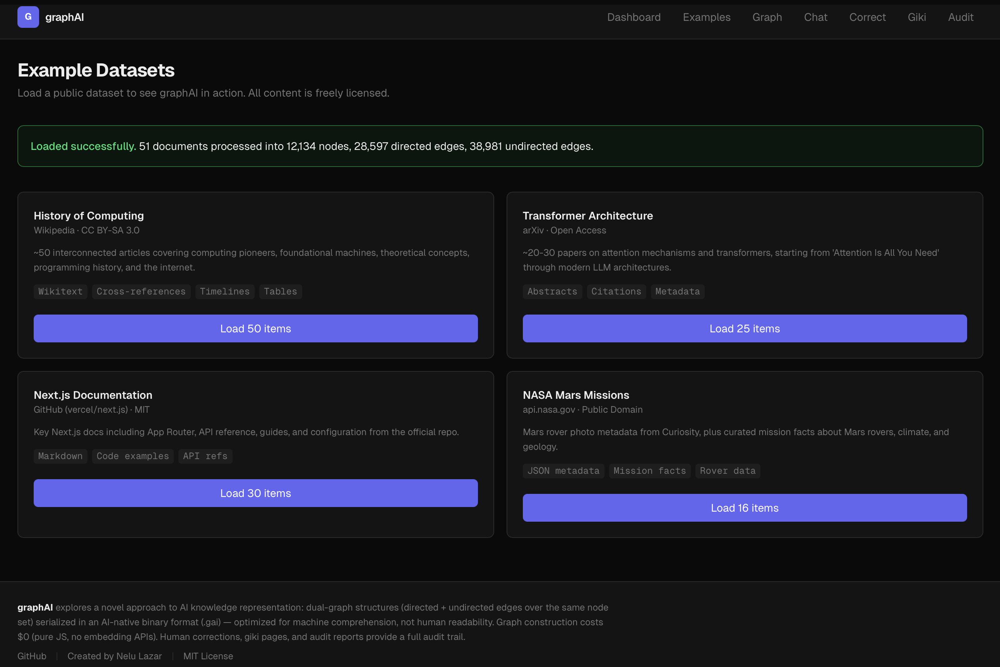
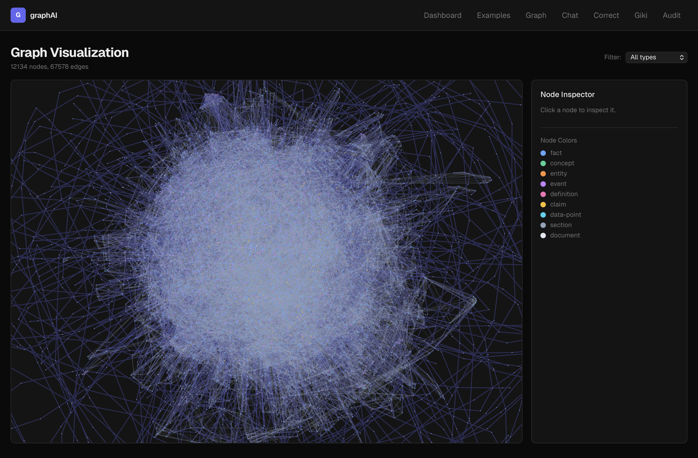
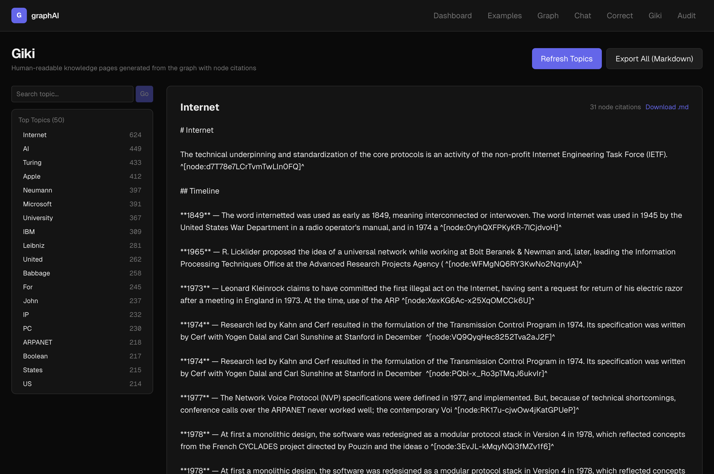
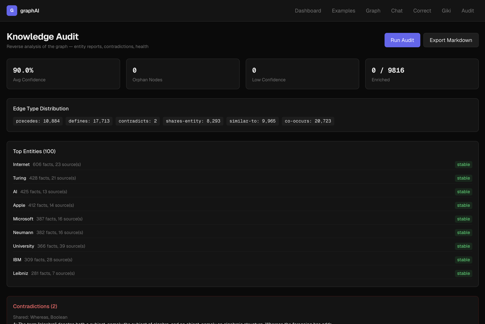

# Graphnosis — Dual-Graph Knowledge System

**Can AI understand files better than humans can read them?**

Graphnosis transforms raw files into AI-optimized directed and undirected graph representations. Instead of feeding AI models flat text chunks (the standard RAG approach), Graphnosis builds a structured knowledge graph with typed relationships — then serializes relevant subgraphs into a format designed for machine comprehension, not human readability.

> The name is a compound of **graph** and **gnosis** (knowledge) — literally "graph knowledge". The `.gai` file extension stands for **Graphnosis AI**, the AI-native knowledge format at the heart of the system.

The result: faster retrieval, richer reasoning, and answers that trace back through explicit relationship chains.

---

## The Question That Started This

> *["Are AI models based on non-oriented graphs?"](original-discussion.md)*

That question — asked casually in a conversation with an AI — unlocked something that had been sitting dormant for decades.

I first wrote code in 1990. Basic language, on a Sintez ZX Spectrum clone connected to a TV set and a tape cassette, in Romania. A few years later, at an Informatics high school, I learned about directed and undirected graphs — oriented and non-oriented, as we called them. They were elegant. They made sense in a way that linear data structures didn't. But at the time, there wasn't much you could do with them beyond textbook exercises.

In the late 1990s, I wrote a C++ class built around machine learning concepts — a neural network training loop that would take a sketchy, hand-drawn letter as input (drawn using a pixel editor I'd built — the [EditIcon](https://github.com/nehloo/EditIcon) project preserves that early tool), run it through repeated training cycles, and process the output until the system recognized what the letter was supposed to be. It worked. It felt like the future. But the future wasn't ready yet.

In the early 2000s, I explored treating electrical harnesses as undirected graphs — modeling the physical wiring of circuits as graph structures to enable faster comprehension and 3D routing of complex harness designs. The concept showed promise, but it was left unexplored. Other things took priority.

Over the years, I explored many startup ideas and concepts across different domains — software, music, events, nonprofits, research. Each one taught something. None of them brought all the threads together.

Then came that question about AI and graphs. And suddenly, everything connected.

The graphs from high school. The neural network from C++. The harness routing from engineering. The startup instinct from years of building things. The realization that AI models might process knowledge more effectively through the same structures I'd been thinking about since I was a teenager — not as human-readable text, but as typed, weighted, traversable graphs.

**The insight: human-readable formats are lossy for AI consumption.** Prose contains redundant phrasing, implicit relationships, linear structure that hides non-linear connections, and ambiguity that humans resolve with world knowledge but AI must guess at. A purpose-built AI-native format could be dramatically more efficient.

Graphnosis is what happens when three decades of scattered ideas finally find their moment.

## How Graphnosis Works for AI

### The Pipeline

```
RAW FILES (any format)  ──>  DETERMINISTIC PIPELINE ($0)  ──>  DUAL GRAPH
                                                                   |
CONVERSATIONS  ─────────────────────────────────────>    TEMPORAL + IDENTITY LAYER
                                                                   |
                                                          LLM ENRICHMENT (optional)
                                                                   |
                                                          ENRICHED GRAPH (.gai)
                                                        /      |        \
                                                   QUERY    GIKI       AUDIT
                                                     |    (pages)    (reports)
                                                  ANSWER
                                                     ^
                                             HUMAN CORRECTIONS
```

**Deterministic pipeline ($0):** Parsing, chunking, entity extraction, TF-IDF similarity, graph construction — all pure JS, zero API calls.

**LLM enrichment (optional):** Adds synthesis (one-sentence insight), contextual explanation, and source quality annotation per node. Costs ~$0.50-2 per dataset.

**Human corrections:** Add facts, edit nodes, supersede outdated info, or bulk-import markdown. Human-corrected nodes get maximum confidence (1.0).

**Forgetting policy:** Forget by topic ("forget everything about my old job"), by time window ("forget everything before March"), or cascade from a source node. All forgetting is soft-delete — nodes remain in the graph for audit but score 0.3x in queries. Nothing is ever permanently destroyed.

**Giki pages:** Human-readable topic pages auto-generated from the graph, with citations back to specific graph nodes.

**Audit reports:** Entity breakdowns, contradiction detection, cross-domain discoveries, health dashboard, markdown export.

### The Dual-Graph Model

Every piece of knowledge exists as a **node**. Nodes are connected by two types of edges:

**Directed edges** (arrows — A -> B) represent:
- `contains` — a section contains a paragraph
- `precedes` — one fact follows another in sequence
- `cites` — one source references another
- `defines` — a definition explains a concept used elsewhere
- `causes`, `supports`, `contradicts` — causal and logical relationships
- `supersedes` — new information replaces old (with provenance)
- `discussed-in` — knowledge traced back to conversation origin
- `knows`, `works-with`, `reports-to` — person relationships

**Undirected edges** (lines — A <-> B) represent:
- `similar-to` — two facts share vocabulary (measured by TF-IDF cosine similarity)
- `shares-entity` — two facts mention the same person, place, or concept
- `co-occurs` — two facts appear in the same section
- `same-person` — two mentions of the same person across sources
- `related-to` — general association between people or concepts

Both edge types exist over the **same node set**. This dual structure gives AI models richer reasoning paths than either graph type alone.

### Temporal Awareness

Every node tracks:
- `createdAt` — when the knowledge was first ingested
- `lastAccessedAt` — when it was last retrieved in a query
- `accessCount` — how many times it's been used
- `validUntil` — optional expiration (for superseded information)
- `confidence` — 0-1 score that decays over time if knowledge isn't reinforced

The query engine applies temporal scoring: recently accessed nodes score higher, frequently used nodes score higher, expired nodes score 0.3x. Knowledge that isn't accessed for 7+ days begins to decay.

### Conversation Memory

Graphnosis ingests conversations (Claude, ChatGPT, Slack, raw text) into the same graph as domain knowledge. Each conversation turn becomes a node with `discussed-in` edges linking to the knowledge it references. This means the system remembers *what you discussed* alongside *what it knows*.

### Identity Layer

Person entities mentioned 2+ times across sources automatically get dedicated person nodes with:
- Inferred attributes (role, organization) from surrounding content
- Relationship edges between co-mentioned persons
- User profile inference from conversation patterns

# The .gai Format

Instead of storing knowledge as human-readable markdown, Graphnosis uses a binary format (`.gai` — short for **Graphnosis AI**) built on MessagePack:

```
[4-byte magic: "GAI" + version]
[4-byte header length]
[MessagePack header: node count, edge count, levels, metadata]
[MessagePack body: nodes, directed edges, undirected edges, hierarchy]
[4-byte checksum]
```

This isn't designed for humans to read. It's designed for AI to consume efficiently — fewer tokens, explicit structure, typed relationships.

### How Queries Work

When you ask a question:

1. **Query decomposition** — Complex questions are split into sub-queries; each is expanded with synonyms derived from the graph itself
2. **Seed finding** — TF-IDF matching across all query variants identifies the most relevant nodes
3. **Graph traversal** — BFS from seed nodes with temporal scoring (recency + frequency + confidence)
4. **Subgraph extraction** — Top 20 nodes + connecting edges, including enriched synthesis when available
5. **Serialization** — Structured format with explicit edges for LLM reasoning:

```
=== KNOWLEDGE SUBGRAPH (20 nodes, 58 edges) ===

--- NODES ---
[n1|event|0.53] The Turing machine was invented in 1936 by Alan Turing...
[n2|fact|0.38] A universal Turing machine can simulate any other Turing machine...

--- DIRECTED ---
n1 -[defines:0.9]-> n2

--- UNDIRECTED ---
n1 ~[similar-to:0.7]~ n2

--- ENRICHED INSIGHTS ---
[event|0.53] SYNTHESIS: Turing's 1936 paper laid the theoretical foundation for all computation
  CONTEXT: This event preceded physical computers by a decade and connects to Church's lambda calculus
```

## Prior Art & What's Different

Graph-based RAG is an active research area. Microsoft's **GraphRAG** (2025) pioneered community detection and hierarchical summaries on knowledge graphs. **LightRAG** (EMNLP 2025) introduced dual-level retrieval combining entity extraction with abstract reasoning. **LazyGraphRAG** achieved 700x query cost reduction vs GraphRAG.

Graphnosis's contribution is a specific combination that hasn't been published as a unified system:

- **Dual-graph** (directed + undirected edges over the same node set) — most systems use one graph type
- **AI-native binary format** (.gai) optimized for machine consumption, not human readability
- **Zero-API graph construction** (TF-IDF, no embeddings required) — $0 to build the graph
- **Human audit trail** — giki pages with node citations, contradiction detection, correction API
- **Temporal awareness** — confidence decay, supersedes edges, access tracking per node
- **Identity layer** — automatic person extraction, relationship edges, user profile inference
- **Reflection engine** — automated contradiction detection, cross-domain discovery, transitive edge inference

No single technique here is new. The novelty is the combination into a unified, open-source system.

## Landscape Comparison

Graphnosis exists alongside other approaches to persistent AI knowledge. Each makes different tradeoffs:

| | **Graphnosis** | **GBrain** (Garry Tan) | **MemPalace** (Milla Jovovich) | **Karpathy Wiki** |
|---|---|---|---|---|
| **Representation** | Dual-graph (.gai binary) | Markdown files in git | Spatial hierarchy + ChromaDB | Markdown wiki pages |
| **Conversation memory** | Yes (Claude/ChatGPT/Slack) | No | Yes (core feature) | No |
| **Identity tracking** | Auto-extracted person nodes | Manual (people/ dir) | No | Partial (entity pages) |
| **Contradiction detection** | Automated | No | No | LLM lint (manual) |
| **LLM cost to build** | $0 + optional enrichment | ~$5-20/dataset | $0 | ~$10-50/dataset |
| **Human auditability** | Giki pages + audit export | Native (markdown) | Partial | Native (wiki) |
| **Relationships** | Explicit typed edges | Implicit links | Tunnels | Implicit cross-refs |
| **Persistence** | SQLite + .gai files | Git repo | ChromaDB + SQLite | Filesystem |

**Where Graphnosis wins:** Relationship-aware reasoning, multi-source knowledge fusion, token efficiency, automated contradiction detection.

**Where others win:** GBrain has native git version control. MemPalace has battle-tested conversation recall (96.6% LongMemEval). Karpathy's pattern produces richer narrative synthesis.

**They complement each other:** MemPalace for conversation memory, GBrain for personal knowledge management, Graphnosis for structured domain knowledge with explicit relationships.

## Why This Matters (vs. Standard RAG)

| Aspect | Standard RAG | Graphnosis |
|--------|-------------|---------|
| Context format | Flat text chunks | Structured subgraph with typed edges |
| Relationships | Implicit (AI must infer) | Explicit (edges with types and weights) |
| Retrieval | Vector similarity on chunks | Graph traversal + synonym expansion + query decomposition |
| Resolution | Fixed chunk size | Hierarchical (zoom in/out via compression levels) |
| Dependencies | Requires embedding API | TF-IDF (pure JS, zero API calls for graph construction) |
| Memory | Stateless per session | Temporal nodes + conversation ingestion + SQLite persistence |
| Corrections | Re-ingest from scratch | In-place edit, supersede, or soft-delete individual nodes |
| Auditability | None | Giki pages, audit reports, contradiction detection |

## Proof-of-Concept Datasets

All datasets use freely-licensed public content:

| Dataset | Source | License | Result |
|---------|--------|---------|--------|
| **History of Computing** | Wikipedia (51 articles) | CC BY-SA 3.0 | 12,199 nodes, 67,578 edges |
| **Transformer Architecture** | arXiv (25 papers) | Open Access | Paper abstracts + metadata |
| **Next.js Documentation** | GitHub (30 pages) | MIT | Markdown docs + code examples |
| **NASA Mars Missions** | api.nasa.gov | Public Domain | Rover data + mission facts |

## Performance

Benchmarked on the Wikipedia dataset (12,199 nodes, 67,578 edges):

- **Avg query time:** 75ms (seed finding + graph traversal + serialization)
- **Avg nodes retrieved:** 20 per query
- **Avg token estimate:** ~2,138 tokens per subgraph context
- **Graph construction:** ~15 seconds for 51 Wikipedia articles

## Getting Started

```bash
# Install dependencies
npm install

# Set up environment (required for chat/LLM features)
cp .env.example .env.local
# Add your OPENAI_API_KEY to .env.local

# Run the development server
npm run dev
```

Open http://localhost:3000 and use the navigation:

| Page | Purpose |
|------|---------|
| **Dashboard** | Graph stats, node/edge type breakdowns |
| **Examples** | Load proof-of-concept datasets (Wikipedia, arXiv, Next.js, NASA) |
| **Graph** | Force-directed visualization with node inspector |
| **Chat** | Query the graph with optional subgraph context panel |
| **Correct** | Add facts, edit nodes, supersede info, bulk-import markdown |
| **Giki** | Browse auto-generated topic pages with node citations |
| **Audit** | Entity reports, contradictions, health dashboard, markdown export |
| **Benchmarks** | Query performance metrics across 10 test queries |

## Project Structure

```
src/
  core/
    types.ts                        # All TypeScript interfaces (40+ types)
    constants.ts                    # Thresholds, magic bytes, stopwords
    ingestion/parsers/              # Markdown, PDF, HTML, CSV/JSON, conversation parsers
    extraction/                     # Chunker, entity extractor, identity extractor
    similarity/                     # TF-IDF, cosine, Jaccard (pure JS)
    graph/                          # Graph builder, directed/undirected edges, incremental updates
    optimization/                   # Deduplicator, pruner, hierarchical compressor, reflection engine
    format/                         # .gai binary writer/reader (MessagePack)
    query/                          # Seed finder, BFS traverser, subgraph serializer,
                                    # synonym expander, query decomposer
    enrichment/                     # LLM-powered node synthesis + context
    corrections/                    # Human correction engine (add/edit/supersede/delete)
    giki/                           # Graph-to-wiki page generator with citations
    audit/                          # Audit report generator + markdown exporter
    persistence/                    # SQLite store (better-sqlite3, WAL mode)
  examples/                         # Wikipedia, arXiv, Next.js docs, NASA Mars fetchers
  app/                              # Next.js App Router — 8 pages + 10 API routes
tests/
  longmemeval/                      # LongMemEval benchmark suite (12 tests, 4 categories)
```

## Tech Stack

- **Next.js 16** (App Router, TypeScript)
- **Vercel AI SDK v6** (chat interface, streaming)
- **MessagePack** (`msgpackr`) for .gai binary format
- **TF-IDF + cosine similarity** (pure JS, no embedding APIs)
- **better-sqlite3** for persistent graph storage (WAL mode)
- **react-force-graph-2d** for graph visualization
- **Tailwind CSS** for UI

All dependencies are MIT or Apache-2.0 licensed. No GPL/LGPL/AGPL.

## Live Demo

Explore the working prototype: **[graphnosis.vercel.app](https://graphnosis.vercel.app)**

## Screenshots

<p align="center">
  
</p>

<p align="center">
  
</p>

<p align="center">
  
</p>

<p align="center">
  
</p>

## License

MIT

## Contributing

This is an active research project exploring AI-native knowledge representation. Contributions welcome — especially around:
- New parser types (DOCX, PPTX, audio transcripts)
- Improved relation extraction (NLP-based `causes`, `contradicts` detection)
- Embedding-based similarity as optional upgrade to TF-IDF
- Benchmark comparisons against standard RAG pipelines (GraphRAG, LightRAG)
- Multi-graph merge (combine multiple .gai files)
- Giki page quality improvements (LLM-assisted narrative generation)
